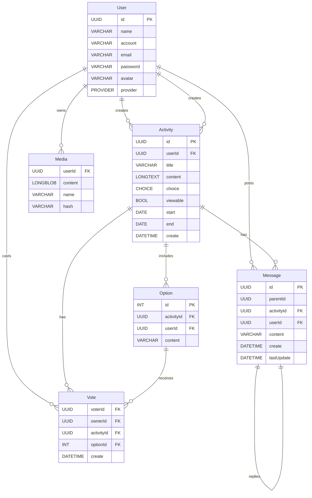

```mermaid
erDiagram
    User{
        UUID id PK
        VARCHAR name
        VARCHAR account
        VARCHAR email
        VARCHAR password
        VARCHAR avatar
        PROVIDER provider
    }

    Activity {
        UUID id PK
        UUID userId FK
        VARCHAR title
        LONGTEXT content
        CHOICE choice
        BOOL viewable
        DATE start
        DATE end
        DATETIME create
    }

    Media{
        UUID userId FK
        LONGBLOB content
        VARCHAR name
        VARCHAR hash
    }

    Option{
        INT id PK
        UUID activityId FK
        UUID userId FK
        VARCHAR content
    }

    Vote{
        UUID voterId FK
        UUID ownerId FK
        UUID activityId FK
        INT optionId FK
        DATETIME create
    }

    Message{
        UUID id PK
        UUID parentId
        UUID activityId FK
        UUID userId FK
        VARCHAR content
        DATETIME create
        DATETIME lastUpdate
    }


    User ||--o{ Activity : creates
    User ||--o{ Media : owns
    User ||--o{ Activity : creates
    User ||--o{ Vote : casts
    User ||--o{ Message : posts

    Activity ||--o{ Option : includes
    Activity ||--o{ Vote : has
    Activity ||--o{ Message : has

    Option ||--o{ Vote : receives

    Message ||--|| Message : replies
```
